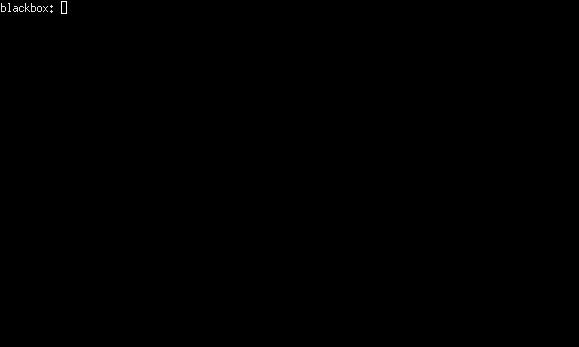

# Take

Purpose of **take** is to provide a convenient way for selecting items
from a list within a text terminal interactively. **take** is the best
tool for filtering a selection when the list of items can't be matched
with wildcards or regexps, i.e. they don't share substrings.

Selection list can be build in number of ways (also from STDIN). When
selection is ready, **take** executes provided command using the
selection.

# Example screencast

# Building and installing

**take** depends on libraries: `termbox2`, `como`, and `plinth`.

**take** is compiled with simple shell script:

    do-build

The compiled binary is placed to `bin/take`.

Installation script is called `do-install`. Please, edit the script
for setting the installation root directory.

The binary and man page can be installed with:

    do-install

# Documentation

**take** includes a comprehensive manual page.

# License

See: COPYING

Copyright (c) 2015, 2025 Tero Isannainen.
